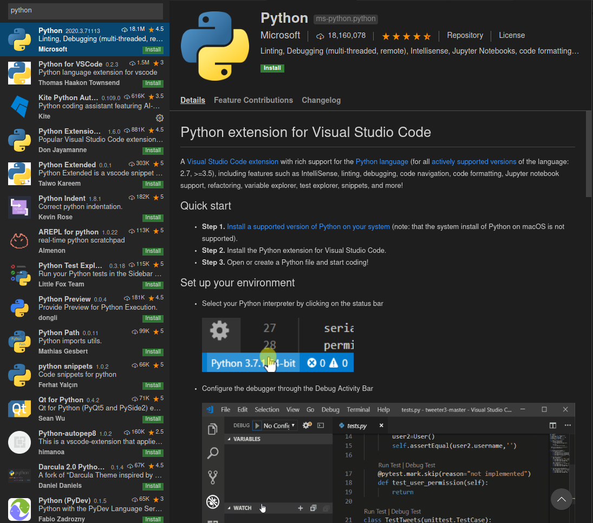

# General Installation
 - This guide will contain how to install everything
   that will be used in this course

## Python
 - Go to [python.org](https://python.org) and click the downloads tab
 - Click the big yellow button right below the
   "Download the latest version" text
 - As of the making of this tutorial, the latest
   version is 3.8.2 but any version after will suffice
 - This will download the installer for your operating
   system, run the installer when it is done downloading
 - Leave the default options as is as they are not
   important at this time, nor do they matter. The big
   option that NEEDS to be checked is "Add Python to PATH"
 - The PATH is the operating systems way of finding,
   programs. Python is a program and we want our computer
   to be able to find it. Otherwise, you may get an error
   saying you don't have Python installed
 - Also, make sure to check the box that says
   "Disable PATH limit", this just makes sure nothing in
   the previous step gets jumbled up
 - After all this Python should be installed. To double
   check, we need to make sure we can run the program that
   reads python files. This is known as the "interpreter"
 - Open Powershell or CMD through the Windows start button,
   and type the command Python. If you see an error message,
   something went wrong. Get me for help if this happens.
   If you see some information about Python, and your prompt
   changes to show ">>>", then you have successfully
   installed Python. You can close powershell or type `quit()`
   to get out of the prompt

## Git
 - Go to [git-scm.com](https://git-scm.com), and click on the orange
   "Downloads" button.
 - Click on the operating system you are using and run the installer
   when it finishes downloading.
 - The default options should be everything you will need, so click
   through the options until it is installed
 - Just like with Python, we need to verify that it is installed
 - Open Powershell, CMD, or a terminal window and type the command "git",
   then press enter. If you see something along the lines of an error,
   something went wrong. But, if you see "Usage" at the top, and a bunch
   of options, Git is installed and you can close out of the window and
   move on to install Visual Studio code.

# Visual Studio Code
 NOTE: Visual Studio code is going to be our editor of choice for this program.
 If you prefer another editor or IDE, that's ok and you can skip this part

 - Go to [code.visualstudio.com](https://code.visualstudio.com), and click the download
   button
 - Run the installer and follow the prompts
 - Run this just like notepad or any other application by opening the applications menu
   and typing "code".
 - Now we need to add some custom features specifically for Python
 - Press `ctrl+shift+x` to open the extension browser, and type `python` in the search
   bar that appears
 - We want to install the first one by microsoft

 - Click the `reload required` button and you are good to go with Visual Studio Code

